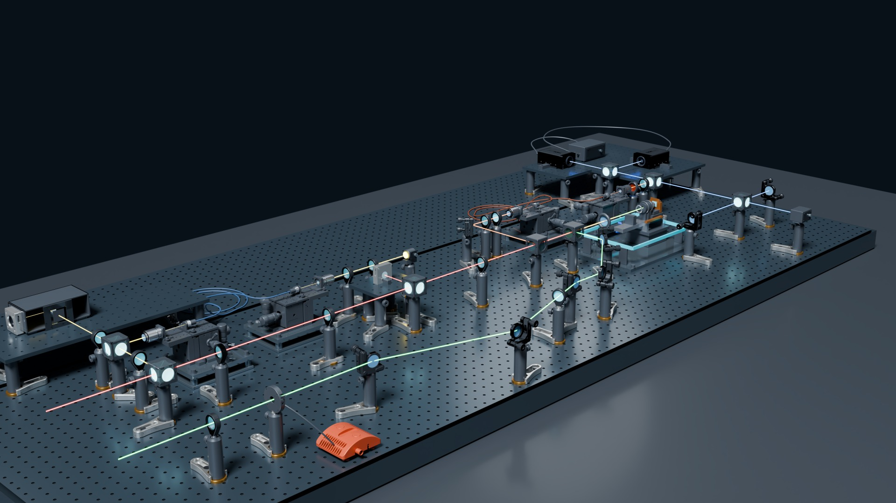
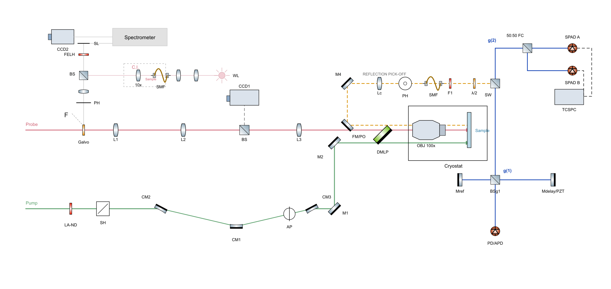
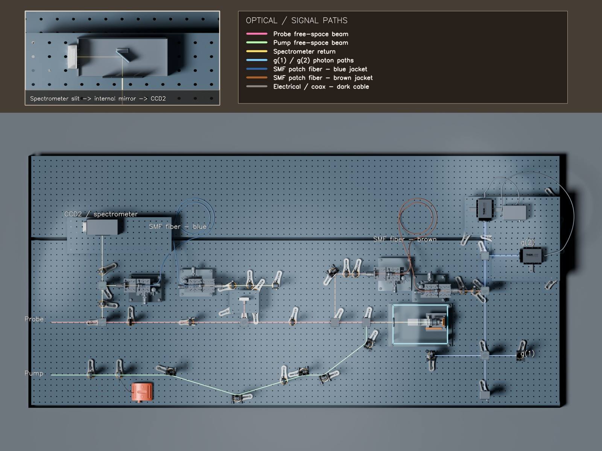

<div align="center">

# OpticalModeler

**From 2D photonics schematics to physically auditable Blender optical tables.**

[](https://github.com/k-telux/OpticalModeler/actions/workflows/validate.yml)
[](https://agentskills.io/)
[](https://www.blender.org/)
[](LICENSE)



</div>

OpticalModeler is an evidence-first Agent Skill for reconstructing laboratory optical paths in Blender. It treats optical topology, real apertures, manufacturer CAD, fasteners, load paths, fiber routing, and artifact lineage as hard acceptance gates—not decorative details.

> **Independent community project.** Not affiliated with or endorsed by Thorlabs, Inc. Product names identify compatible hardware only. A rendered CAD assembly is not a mechanical, spectral, laser-safety, or experimental certification.

## Why OpticalModeler

| Physical assembly | Optical truth | Fail-closed evidence |
|---|---|---|
| Post-first placement, real table holes, fasteners, load paths, and supported hardware. | Centered apertures, splitter planes, branch continuity, internal fine beams, and fiber bend constraints. | Reopened-scene audits, ray/BVH checks, hashes, manifests, annotated renders, and explicit `PASS` / `BLOCKED` / `UNVERIFIED` states. |

## 2D input → verified 3D output

| Original schematic | Annotated 3D reconstruction |
|---|---|
|  |  |

The sanitized [G1/G2 case study](examples/g1g2/README.md) includes the original 2D input, editorial 3D renders, and a machine-readable acceptance record. Vendor STEP/CAD files and the large laboratory `.blend` are intentionally excluded.

## Install

With a compatible Agent Skills installer:

```bash
npx skills add k-telux/OpticalModeler
```

Or copy `skills/thorlabs-blender-optical-path` into your agent's skills directory.

## Quick start
Send message below to your agent:

```text
Use $thorlabs-blender-optical-path to reconstruct this 2D schematic in Blender.
```

```text
Audit this optical table for real post/load paths, centered apertures, beam clearance, fiber bend radius, and stale evidence.
```

The skill guides the agent to:

1. map schematic nodes to experimental roles, real assets, ports, and support paths;
2. solve optical centers, surfaces, splitter planes, and branch continuity;
3. assemble hardware post-first from verified table holes;
4. prove one representative instance before propagation;
5. reopen the saved scene and run mesh, ray, and BVH checks;
6. package visual, GLB, report, manifest, hash, and rule-compliance evidence consistently.

## Validation and limits

- Manufacturer CAD is an asset source, never proof of correct assembly.
- Free-space rays, guided fiber, and electrical cables remain semantically distinct.
- Whole-project success requires an active-rule compliance matrix; scoped evidence stays `PARTIAL/SCOPED`.
- The repository excludes third-party CAD, private paths, oversized Blend files, and unsupported real-world performance claims.
- Every release is checked for skill metadata, links, file size, privacy leaks, forbidden CAD binaries, and acceptance-state consistency.

See [CONTRIBUTING.md](CONTRIBUTING.md) for rule proposals and case-study submissions, and [SECURITY.md](SECURITY.md) for responsible disclosure.

Maintained by [telux](https://github.com/k-telux). Released under the [MIT License](LICENSE).
