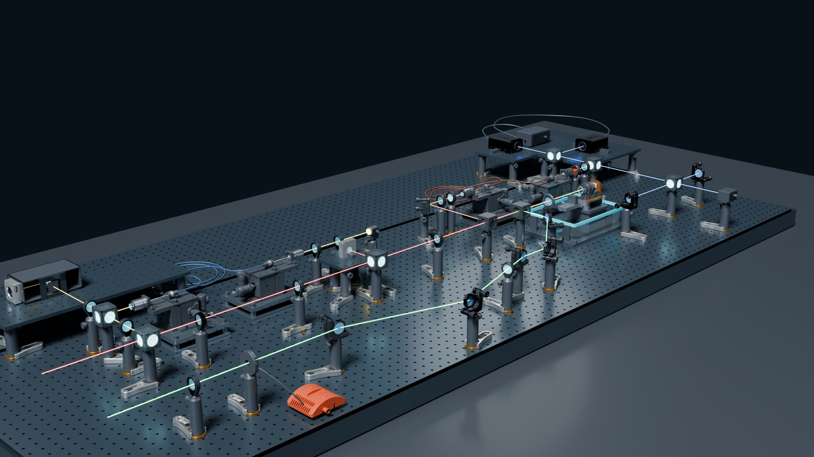
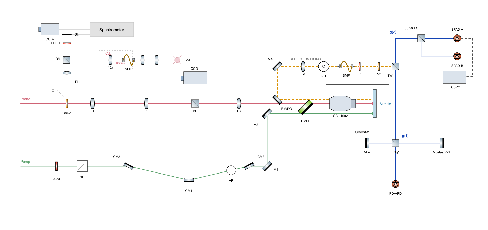
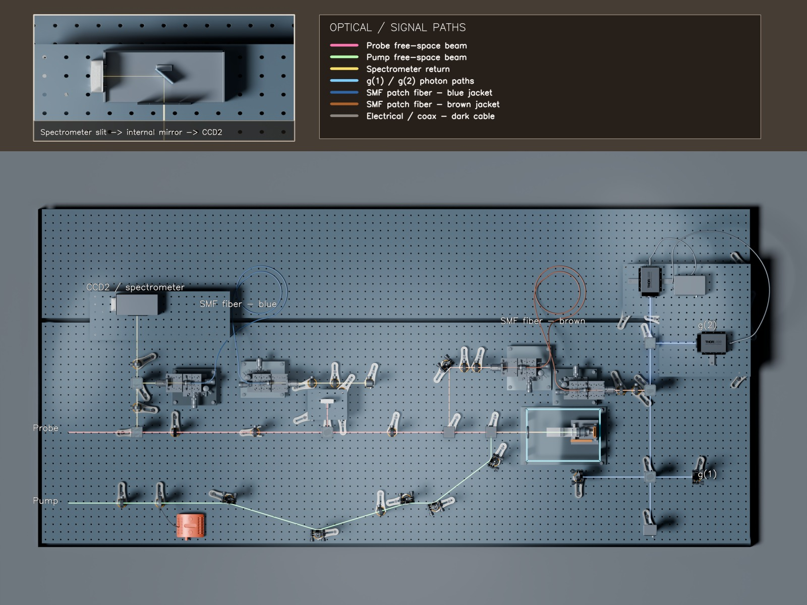

<div align="center">

# OpticalModeler

**OpticalModeler 2.0：从示意图与照片到可编辑、有证据边界的光学系统。**

[English](README.md) · [简体中文](README.zh-CN.md) · [日本語](README.ja.md)

[](https://github.com/k-telux/OpticalModeler/actions/workflows/validate.yml)
[](https://agentskills.io/)
[](LICENSE)



</div>

OpticalModeler 是一个证据优先的 Agent Skill，用于在 Blender 中重建实验室光路。它把光路拓扑、真实孔径、厂家 CAD、紧固件、承载链、光纤布线和证据血缘作为硬性验收门槛，而不是装饰细节。

> **独立社区项目。** 与 Thorlabs, Inc. 无隶属或背书关系。产品名称仅用于识别兼容硬件。渲染的 CAD 装配不构成机械、光谱、激光安全或实验性能认证。

## 核心能力

| 物理装配 | 光学真实性 | Fail-closed 证据 |
|---|---|---|
| 立柱优先、真实台孔、紧固件、承载链与受支撑硬件。 | 孔径居中、分束平面、支路连续、内部细束与光纤弯曲约束。 | 重开场景审计、光线/BVH 检查、哈希、清单、标注渲染与明确状态。 |

## 二维输入 → 已验证三维输出

| 原始光路图 | 标注后的三维重建 |
|---|---|
|  |  |

脱敏的 [G1/G2 案例](examples/g1g2/README.md)包含二维原始输入、编辑级三维渲染和机器可读验收记录。厂家 STEP/CAD 与大型实验 `.blend` 不进入 Git。

## 整机单链 workflow

当前主 workflow 是一个有序运行：一个 run ID、一个修订目录、一个写入者、一条生成器谱系、一条 Blender 场景谱系和一本 append-only 证据账本。来源锁、拓扑、CAD 谱系、代表件 smoke、整机传播、保存场景重开、光机审计、渲染与脱敏，都是同一次运行中的阶段门，不能由多个独立模块事后拼接。

从[端到端 workflow 合同](skills/thorlabs-blender-optical-path/references/end-to-end-workflow.md)、[单次运行的 N04 确定性重放](examples/end-to-end-workflow/n04-v1.0.1-replay/README.md)和[全新整机运行手册](examples/end-to-end-workflow/n04-v1.0.1-replay/RUNBOOK.md)开始。静态重放因仓库排除厂家 CAD 和代表件保存 `.blend` 而如实停在 `UNVERIFIED`，所有下游门保持 pending；全新私有 revision 可连续执行已公开的下载、构建、重开、审计与净化脚本。

## v2.0.0：照片重建、受约束纠正与完整交互案例

2.0 将照片重建、固定上层端点的局部移动、仪器端口/快门状态，以及独立展示副本明确区分。实装、厂家候选和拟装器件分别记录；用户意图单独验收；接受文件冻结；图片保留真实 producer，不以改清单冒充新渲染。

[六组案例索引与真实公开输入/输出](examples/v2.0/README.md)和[中文完整交互对话](examples/v2.0/WALKTHROUGHS.zh-CN.md)展示从初始请求、必要确认、用户否决/纠正到检查及最终产出。包括二维重建、照片重建、紧凑平移、外壳/打光、拟装探测器与快门、失败审计/断点交付；每组说明具体交付和仍未知的物理事实。另有[英文完整案例](examples/v2.0/WALKTHROUGHS.md)。

| 用户需求 | 对应指南 | 交付边界 |
|---|---|---|
| 按照片保留旧基线重建 | [照片重建与修订](skills/thorlabs-blender-optical-path/references/photo-reconstruction-and-revisions.md) | 完整私有可编辑审阅模型，实装/候选/参考/未知分开。 |
| 只移动下层支路，上层固定 | [约束与意图](skills/thorlabs-blender-optical-path/references/photo-reconstruction-and-revisions.md#3-lock-constraints-before-moving-anything) | 整族平移、内部向量与固定端点、完整 footprint 和邻居证据。 |
| 外壳太白，模型和相机不动 | [展示与交付](skills/thorlabs-blender-optical-path/references/presentation-and-delivery.md) | 独立展示副本、保存后保持检查和受影响视角新图。 |
| 总结到 GitHub，但不暴露 lab | [发布隐私](skills/thorlabs-blender-optical-path/references/publication-privacy.md) | 功能别名、精选文件、私有词表扫描及逐图/容器检查。 |

实验室案例抹去关键型号、实际坐标/参数、私有照片/模型和映射；对话是教学改写，不是原始聊天。已公开独立示例的厂家来源保留，不据此宣称 lab 实装。2.0 是 Skill 文档与 ledger 软件更新，没有新几何运行、盲测或物理认证；历史 verdict 不变。全部变化见[更新日志](CHANGELOG.md#200--2026-10-07)。

```text
使用 $thorlabs-blender-optical-path 按标注照片在已接受基线上重建。
保留原文件和固定上层端点，只生成 optics-only。交付一个可编辑审阅模型、
清楚的最终视图和现场测量清单。区分实装、候选和拟装；实验室关键型号、
照片与完整场景保持私有，不把渲染通过写成实机合格。
```

## v1.2.0：新光路设计、明确范围与预览验收

用户要求“参考旧示例的精度生成另一种测量光路”时，Skill 明确从新拓扑和空场景开始，区分可复用的器件资产与旧整机场景。optics-only 保留光学探测器和真实支撑，排除电路及电气/数据可视化。

[新设计指南](skills/thorlabs-blender-optical-path/references/fresh-design-and-rendering.md)整理了器件细节、可见光路、真实端口测量、预览/最终渲染、runtime 隔离与及时发布。[MZI 预览局限案例](examples/fresh-design/mzi-preview/README.md)明确说明：同名器件族命中、常量零端点误差、全图图像评分和 2048 宽预览，均不足以证明完整物理验收或 4K 交付。

本版发布的是 Skill 与证据规则更新，不是新仪器的物理合格认证；历史模型状态保持原判。全部变化见[更新日志](CHANGELOG.md#120--2026-09-04)。

```text
使用 $thorlabs-blender-optical-path 设计一种新的 optics-only 测量光路。
G1/G2 旧例仅作建模与渲染质量参考。从空场景和有来源记录的器件资产开始，
建立新拓扑，检查真实光路与支撑，完成指定最终分辨率的视图后集中交付。
```

## v1.1.0 多轮资格测试

[v1.1.0 资格包](examples/end-to-end-workflow/qualification-v1.1.0/README.md)对比了 64/96/128 节点 N04 规模运行和一个独立 40 节点多状态干涉仪测试。权威结论分别保留为 `PARTIAL_SCOPED`、严格 BVH `BLOCKED`、仅规模子集 `PASS_SCOPED` 和 topology `UNVERIFIED`；没有任何轨道提供整机物理或 release PASS。

多轮测试加固了 source bundle 原子提交、live/pinned CAD 身份分离、cache alias、ledger replay、execution/claim 状态分离、representative spacing/load、严格碰撞分类、多状态 topology 和公开包净化。版本记录见 [CHANGELOG.md](CHANGELOG.md)。

## 公开前向测试

[四轨公开测试矩阵](examples/forward-tests/README.md)记录了仅使用发布版 `v1.0.0` Skill 的 light-sheet/N04、自由空间干涉仪、OCT 与 Thorlabs CAD 转换测试。它公开净化后的 evidence package、完整标记 workflow、生成日志和可重放脚本，同时保持最弱 verdict：N04 仅传播门 `PASS`/整体 `PARTIAL_SCOPED`，干涉仪为 `PARTIAL_SCOPED`，OCT 为 `UNVERIFIED`，CAD 转换为 `BLOCKED`。

这些测试新增三项 release gate：公共脚本必须重算出相同语义锁；README/GATE 数值必须来自 reopen evidence；二进制与 PNG 元数据必须逐文件解析，不能把解码失败当成零命中。脱敏 `PASS` 不会覆盖几何或转换 `BLOCKED`。

四轨矩阵只保留为历史缺陷发现记录；四个 evidence package 不得拼接成一个整机结论。

## 安装

发布前运行 `python scripts/validate_repository.py`；本地可加 `--private-terms-file /private/release-inputs/sensitive-terms.txt`，词表必须在仓库外。扫描覆盖候选文件名和未压缩 UTF-8/UTF-16 字节，不能替代图像像素、压缩包/容器内部和间接身份信息检查。既有 manifest、PNG 与软件回归检查保持。

```bash
npx skills add k-telux/OpticalModeler
```

也可以把 `skills/thorlabs-blender-optical-path` 复制到 Agent 的 skills 目录。

## 调用示例

```text
使用 $thorlabs-blender-optical-path 把这张 pump-probe 示意图重建为 Blender 光学平台，并生成 fail-closed 物理审计。
```

英文 Skill 是技术权威源；[简体中文 Skill](i18n/zh-CN/SKILL.md)提供中文入口，并明确继承英文版的几何与证据合同。仓库还包含[项目规则模板](rules/OPTICAL_PATH_PROJECT_MEMORY_TEMPLATE.md)、无第三方依赖的发布验证器与像素数据保持不变的 PNG metadata 清理器。

维护者：[telux](https://github.com/k-telux) · [MIT License](LICENSE)
