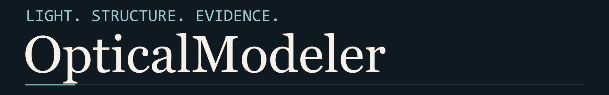
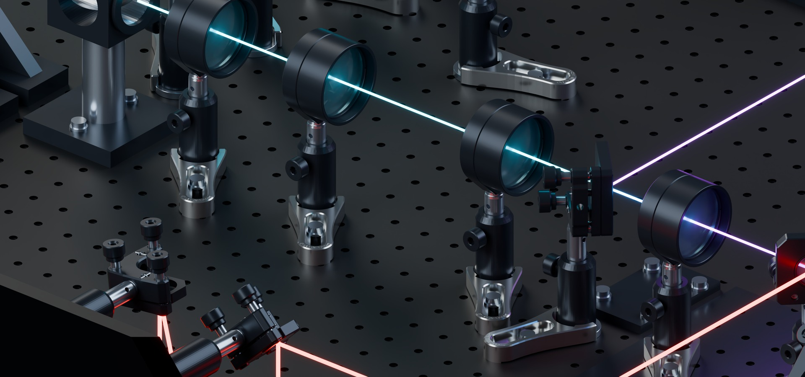

# OpticalModeler

[English](README.md) · [简体中文](README.zh-CN.md) · [日本語](README.ja.md) &nbsp; / &nbsp; [v2.0.0](https://github.com/k-telux/OpticalModeler/releases/tag/v2.0.0)

[使用 Skill](skills/thorlabs-blender-optical-path/SKILL.md) &nbsp; [完整案例](examples/v2.0/WALKTHROUGHS.zh-CN.md) &nbsp; [证据合同](skills/thorlabs-blender-optical-path/references/evidence-contract.md)

<p>


</p>

<sub>正式模型的新相机视图。器件布局与光线几何保持；关键仪器身份与私有场景文件不公开。</sub>

**设计光路，也保留支持它的证据。**

OpticalModeler 是一个 Agent Skill，把测量需求、示意图和现场照片转换成可编辑的 Blender 光学系统。它将光线连接到真实孔径、安装接口与支撑链，再让保存模型、检查和最终视图共同指向同一个结果。

---

## 01 / 从你的实际需求开始

使用兼容的 Agent Skills 安装器：

`npx skills add k-telux/OpticalModeler`

然后告诉 Agent：依据什么、允许改什么、需要交付什么。

```text
使用
$thorlabs-blender-optical-path
按标注照片重建已接受的基线。
保留原文件、固定上层端点。
交付 optics-only 审阅模型、
最终视图与现场测量清单。
区分实装、候选和拟装器件。
```

手动安装时，将 [skill 文件夹](skills/thorlabs-blender-optical-path)复制到 Agent 的 skills 目录。

## 02 / 选择工作类型，守住改动边界

| 你的目标 | 工作从哪里开始 |
|---|---|
| **设计**新的测量光路 | 空场景、有来源依据的新拓扑和可复用器件资产。 |
| **重建**图纸或现场照片 | 权威输入，以及用户明确要求保留的基线。 |
| **纠正**已接受模型 | 冻结原件，声明受保护对象与可动自由度。 |
| **审核**已有场景 | 只读证据、实际保存几何与明确问题。 |
| **展示**已接受结果 | 独立相机/灯光副本，保持几何与图片来源记录。 |

固定的上层端点保持固定；移动光学器件时连同镜架与支撑；拟装相机继续标为拟装。清楚的渲染证明展示效果，不会自动闭合未知物理接口。

## 03 / 从请求到最终交付

六组完整交互保留了真正影响结果的决定，包括用户否决、修正和最终产出：

- **A — 二维图到完整场景。** 重建全过程附真实公开输入、最终预览和历史证据。
- **B — 照片齐全，规格仍未知。** 先交付可检查的完整模型，区分实装身份与估计值。
- **C — 紧凑布局，保留原光路。** 经用户否决后重新锁定内部向量、固定端点和授权移动范围。
- **D — 更好的打光，同一台仪器。** 保存独立展示副本，检查科学几何保持，并生成受影响视角的新图。
- **E — 一个入口，选择输出。** 明确拟装 detector 和快门状态，不编造仪器内部传输。
- **F — 程序退出，证据缺失。** 交付合法记录或可复现 blocker/恢复点，不沿用旧 PASS。

[打开中文完整交互案例 →](examples/v2.0/WALKTHROUGHS.zh-CN.md) · [English dialogues](examples/v2.0/WALKTHROUGHS.md)

实验室案例是教学性脱敏改写。私有照片、实际坐标、关键型号和整机场景不随仓库分发。

## 04 / 光路、结构与证据始终相连

**光路。** 有向支路、实际工作面、孔径与探测终点；自由空间光和光纤各有明确角色。

**结构。** 真实安装接口、桌孔、紧固件与连续支撑。重复布置前先验代表件；保存后检查受影响邻居。

**证据。** 一条场景谱系、新鲜重开测量、实际图片 producer 和一致清单。执行成功、厂家 CAD 和清晰成图分别支持自己的声明。

[端到端 workflow](skills/thorlabs-blender-optical-path/references/end-to-end-workflow.md) · [照片重建](skills/thorlabs-blender-optical-path/references/photo-reconstruction-and-revisions.md) · [展示与交付](skills/thorlabs-blender-optical-path/references/presentation-and-delivery.md)

## 05 / 知道结果真正证明了什么

| 状态 | 能得到的结论 |
|---|---|
| **PASS** | 声明范围内的适用门有当前证据。 |
| **PARTIAL / SCOPED** | 已检查明确子集，剩余 blocker 与限制保留。 |
| **UNVERIFIED** | 必需证据缺失或无法下结论。 |
| **BLOCKED** | 已知要求未通过。 |

`READY_FOR_USER_REVIEW` 表示所需交付可供检查，不认证实装硬件、螺纹预紧、对准、光学性能或激光安全。新封面来自已有模型的局部展示，继承的物理限制保留。[配图来源](assets/readme/MANIFEST.json) · [发布脱敏](skills/thorlabs-blender-optical-path/references/publication-privacy.md)

<details>
<summary><strong>历史模型与资格测试</strong></summary>

- [G1/G2：示意图、最终渲染与脱敏历史验收](examples/g1g2/README.md)。提供压缩预览，私有 Blend 与厂家 CAD 不公开。
- [N04 单次整机 workflow 与重放](examples/end-to-end-workflow/n04-v1.0.1-replay/README.md)。分发的静态重放在缺少私有资产时保持 `UNVERIFIED`。
- [多轮资格测试](examples/end-to-end-workflow/qualification-v1.1.0/README.md)。各 scoped/blocked/unverified 结果分开，没有整机物理 PASS。
- [MZI 预览局限](examples/fresh-design/mzi-preview/README.md)。常量零误差、同族命中与小预览不足以证明最终验收。
- [四轨公开前向测试](examples/forward-tests/README.md)。是历史缺陷发现证据，不能拼接成一个新整机。

</details>

<details>
<summary><strong>验证、贡献与来源边界</strong></summary>

`python scripts/validate_repository.py`

验证器检查三语入口、资源、清单、历史 verdict、PNG metadata 和可运行的软件检查。发布实验室经验时，私有标识策略留在仓库外，并单独检查像素及容器内容，见[脱敏指南](skills/thorlabs-blender-optical-path/references/publication-privacy.md)。

[更新日志](CHANGELOG.md) · [贡献指南](CONTRIBUTING.md) · [第三方声明](THIRD_PARTY_NOTICES.md) · [安全](SECURITY.md) · [项目记忆模板](rules/OPTICAL_PATH_PROJECT_MEMORY_TEMPLATE.md)

</details>

---

独立社区 workflow，与 Thorlabs 无隶属或背书关系。英文为技术权威源；[中文](i18n/zh-CN/SKILL.md)与[日文](i18n/ja/SKILL.md)入口保持其证据要求。

维护者：[telux](https://github.com/k-telux) · [MIT License](LICENSE)
