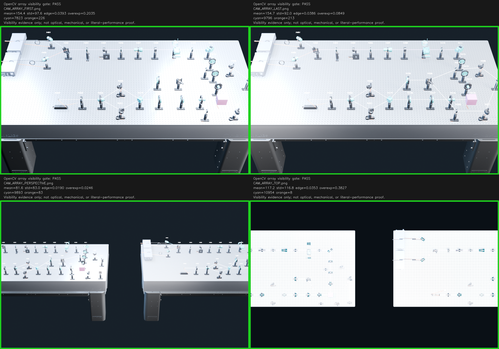
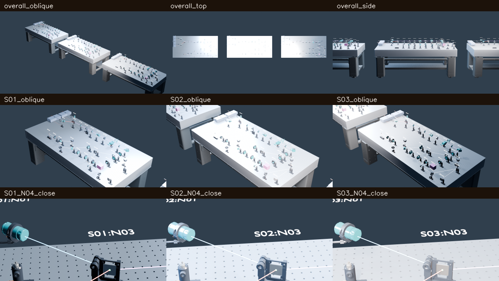
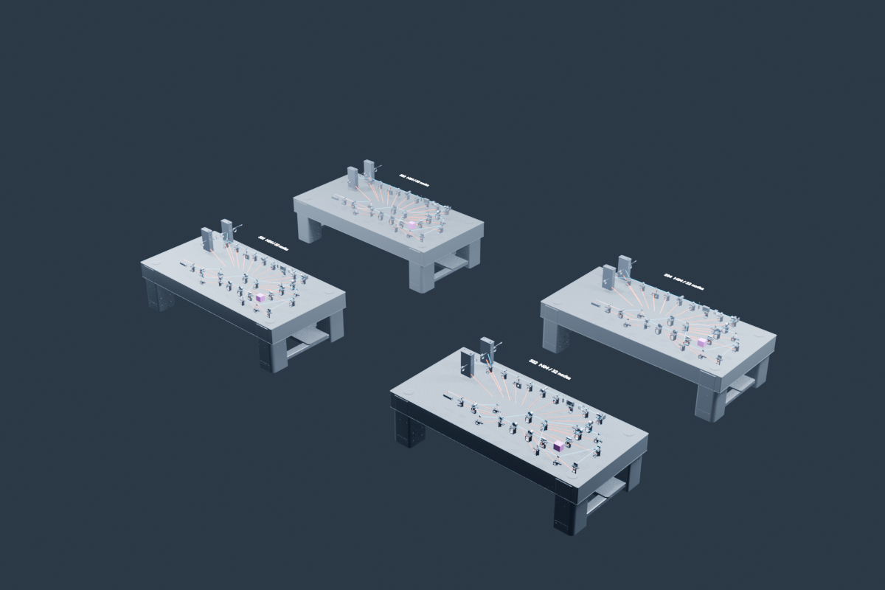

# OpticalModeler v1.1.0 multi-run qualification

This package records four independent or scoped whole-system workflow exercises used to harden the Skill and ledger. It is evidence for the `v1.1.0` workflow/tooling release, not a physical-system release and not a license to combine track verdicts.

Start with [QUALIFICATION_MATRIX.json](QUALIFICATION_MATRIX.json) for the exact per-track statuses and [CROSS_THREAD_CONSENSUS.json](CROSS_THREAD_CONSENSUS.json) for the writer–auditor consensus.
The executable sequence is documented in [RUNBOOK.md](RUNBOOK.md).
The self-excluding [PUBLIC_MANIFEST.json](PUBLIC_MANIFEST.json) is generated after every payload file; repository validation performs the read-only postscan without writing back into this package.

| Track | Scale | Authoritative result |
|---|---:|---|
| N04 root qualification | 64 nodes / 88 directed edges | `PARTIAL_SCOPED` |
| N04 isolated strict test | 96 nodes / 132 directed edges | `BLOCKED` at whole-system BVH; 15 illegal overlaps |
| N04 isolated serialization stress | 128 nodes / 176 directed edges | `PASS_SCOPED_SCALE_ONLY`, aggregate `PARTIAL_SCOPED` |
| Isolated free-space interferometer | 40 nodes / 66 directed edges | `UNVERIFIED` at topology lock |

The 64-node contact sheet shows two complete station copies; the 96-node sheet is deliberately retained even though the physical claim is blocked; the 128-node oblique view demonstrates only the scoped scale/visibility result.

## Reusable scripts

The [scripts](scripts) directory contains the deterministic array lock/replay, rigid scene expansion, two factory-reopen checks, visibility audit, and scoped finalizer used by the 64-node qualification lineage. They intentionally do not claim a strict intra-station collision PASS. A whole-system physical verdict must additionally apply the v1.1.0 strict-collision rule to every evaluated-world-mesh AABB candidate; the 96-node fixture proves why blanket same-node exemptions are forbidden.

Begin with the base [N04 whole-system runbook](../n04-v1.0.1-replay/RUNBOOK.md), materialize its complete source/CAD/drawing contracts, then run `build_array_lock.py` before the representative and full-scene stages. New run specs should set `require_claim_status=true` and record both `--status` and `--claim-status`.

## Scope boundaries

- No STEP, STL, Blend, vendor drawing, runtime archive, or private path is included.
- The rendered images are visibility evidence only.
- S4FC488 live-source drift is a dated regression fixture, not a universal statement about the product.
- Literal paper performance, force/torque/dynamic calibration, vendor-CAD redistribution, and whole-system physical certification remain blocked or unverified as stated in the matrix.
