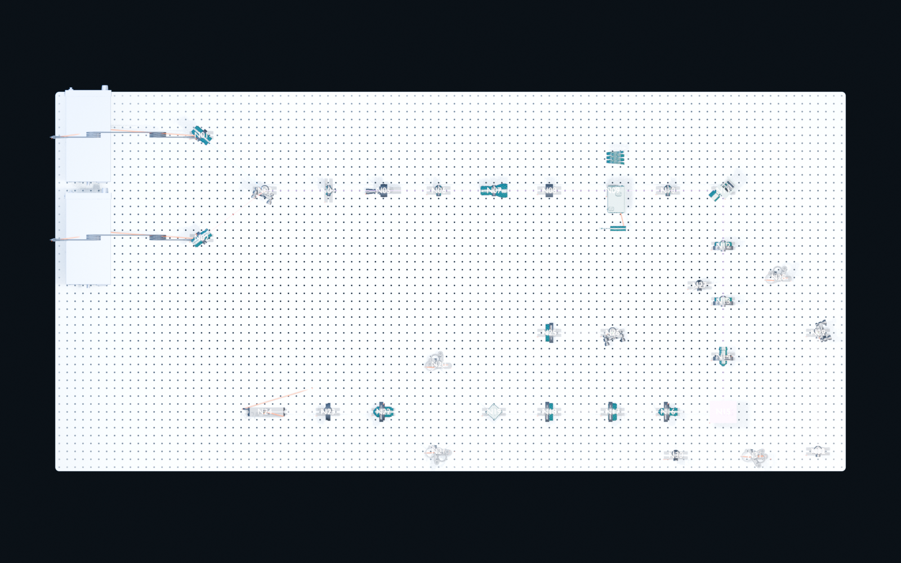
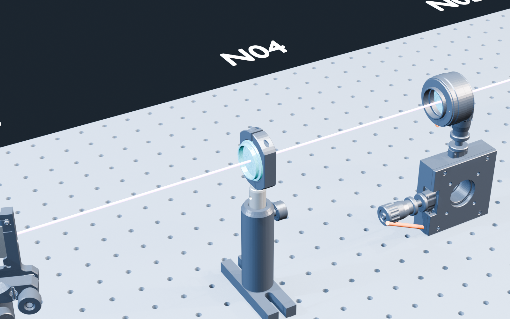

# N04 light-sheet deterministic workflow reference

This curated public reference records the repaired 32-node propagation workflow from the isolated OpticalModeler `v1.0.0` forward test. It includes the literature/source lock, exact directed topology, official-CAD manifest, deterministic build parameters, replay audit, generation scripts, marked workflow, generation log, and two metadata-stripped visual references.

## Status boundary

| Claim | Status |
|---|---|
| `FULL_32_NODE_PROPAGATION_GATE` | `PASS` |
| Model scope | `PARTIAL_SCOPED` |
| Literal paper performance | `BLOCKED` |
| Final/release | `BLOCKED` |
| Public reference sanitization | `PASS` |

The propagation result is intentionally not a release or experimental-performance certification. See [PUBLIC_EXAMPLE_GATE.json](PUBLIC_EXAMPLE_GATE.json) for the machine-readable boundary.

## Deterministic replay

The first candidate was revoked because the public lock script snapped N30 and N31 to stale positions that differed from the released lock and saved scene. The repaired [make_full_locks.py](scripts/make_full_locks.py) encodes both optical-port-center overrides with reasons, and [BUILD_PARAMS_RECOMPUTE_AUDIT.json](BUILD_PARAMS_RECOMPUTE_AUDIT.json) reports identical published/recomputed semantic hashes with an empty field-difference list.

The marked [WORKFLOW.md](WORKFLOW.md) and [GENERATION_LOG.md](GENERATION_LOG.md) show the full command order and both revoked-gate diagnoses. The scripts require official vendor CAD fetched from the URLs in [CAD_MANIFEST.json](CAD_MANIFEST.json); verify the listed hashes and do not redistribute vendor geometry.

## Literature and licensing

The topology is based on Dibaji et al., “Axial de-scanning using remote focusing in the detection arm of light-sheet microscopy,” *Nature Communications* 15, 5019 (2024), DOI [10.1038/s41467-024-49291-0](https://doi.org/10.1038/s41467-024-49291-0), licensed under [CC BY 4.0](https://creativecommons.org/licenses/by/4.0/). The primary topology input is [Supplementary Figure 2](literature/Dibaji2024_SuppFig2.png); the publisher [article](literature/Dibaji2024_article.pdf) and [supplement](literature/Dibaji2024_supplement.pdf) retain their original attribution and license.

## Public-copy sanitization

The two included render copies had `eXIf` and `tEXt` chunks removed after the isolated test. `IHDR`, concatenated `IDAT`, and decoded scanline hashes remained unchanged; the source evidence files were not modified. [SANITIZATION_REPORT.json](SANITIZATION_REPORT.json) records both before/after digests. This curated reference has its own self-excluding [MANIFEST.json](MANIFEST.json), separate from the frozen full-package manifest cited in the gate record.

The images make the workflow inspectable, while saved-Blend, vendor-derived meshes, runtime archives, and unsupported performance claims remain excluded as documented in [EXCLUSIONS.md](EXCLUSIONS.md).
